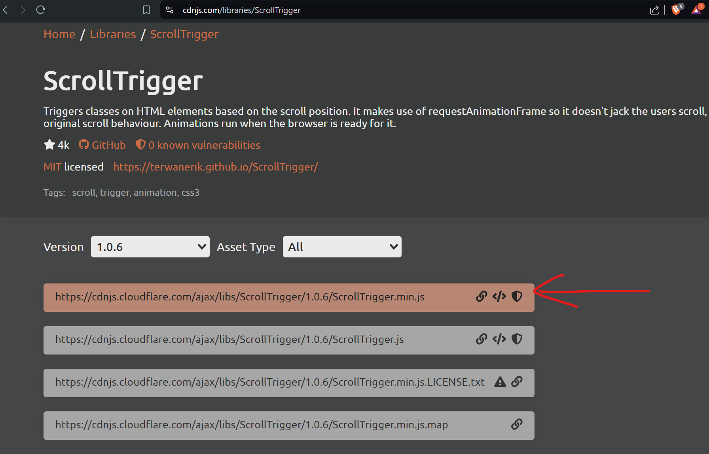

GSAP CDN : https://cdnjs.com/libraries/gsap
scrollTrigger CDN : https://cdnjs.com/libraries/ScrollTrigger
Locomotive CDN : https://cdn.jsdelivr.net/npm/locomotive-scroll@3.5.4/dist/

In head , have to add Locomotive Css -- Opend URL(link)


```html
<link rel="stylesheet" href="https://cdn.jsdelivr.net/npm/locomotive-scroll@3.5.4/dist/locomotive-scroll.css">
```


In body
```html
    <!-- Locomotive js     -->
    <script src="https://cdn.jsdelivr.net/npm/locomotive-scroll@3.5.4/dist/locomotive-scroll.js"></script>    

    <script src="https://cdnjs.cloudflare.com/ajax/libs/gsap/3.12.5/gsap.min.js" integrity="sha512-7eHRwcbYkK4d9g/6tD/mhkf++eoTHwpNM9woBxtPUBWm67zeAfFC+HrdoE2GanKeocly/VxeLvIqwvCdk7qScg==" crossorigin="anonymous" referrerpolicy="no-referrer"></script>

    <!-- scroll triggered cdn -->
    <script src="https://cdnjs.cloudflare.com/ajax/libs/gsap/3.12.5/ScrollTrigger.min.js" integrity="sha512-onMTRKJBKz8M1TnqqDuGBlowlH0ohFzMXYRNebz+yOcc5TQr/zAKsthzhuv0hiyUKEiQEQXEynnXCvNTOk50dg==" crossorigin="anonymous" referrerpolicy="no-referrer"></script>

    <script src="script.js"></script>
```




